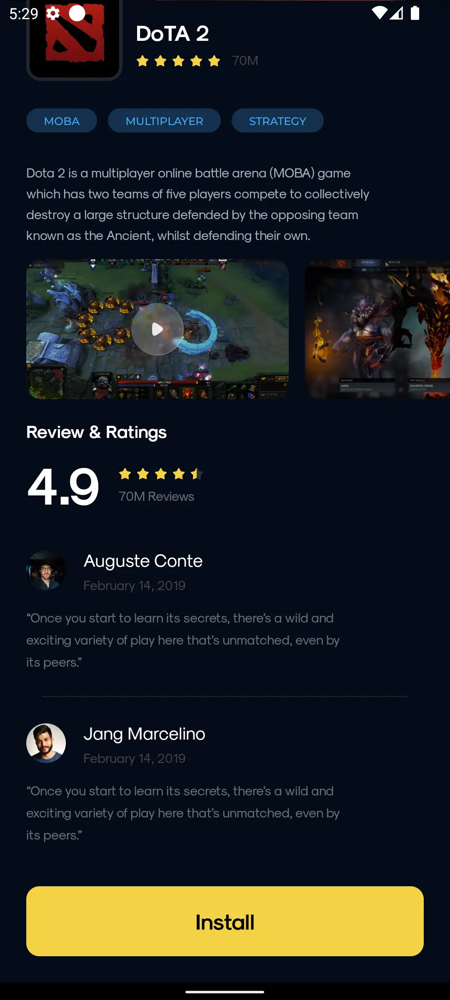
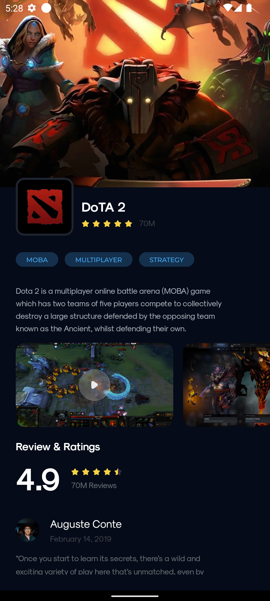

# Effective lab №1, Android

## Screenshots

### Game detail screen

|                       First part                       |                       Second part                       |
|:------------------------------------------------------:|:-------------------------------------------------------:|
|  |  |

|                                                Video                                                |
|:---------------------------------------------------------------------------------------------------:|
|  |

## Topics

* DI
* Compose Based UI
* Gradle Configuration

## How to run

* You need Android Studio (at least Giraffe)
* Run -> Run 'app'

## APK placed in assets folder

## Who to contact with questions

* [Popkov Denis](https://t.me/MolodoyDenis)
